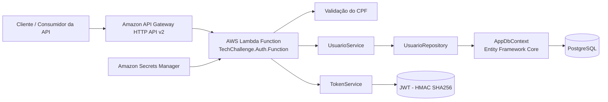

# TechChallenge.Auth

Microserviço de autenticação do projeto TechChallenge, responsável por validar o CPF informado e emitir um token JWT para o cliente autenticado.

## Objetivo

Este repositório implementa a API de autenticação por CPF com integração a banco PostgreSQL via Entity Framework Core, uso de AWS Lambda + Amazon API Gateway HTTP API v2 e geração de token JWT com assinatura HMAC SHA256.

O fluxo principal do serviço é:

1. Receber uma requisição HTTP POST na rota `/auth/cpf`.
2. Validar o payload e o formato do CPF.
3. Consultar o usuário no repositório de dados.
4. Gerar um token JWT com claims do usuário.
5. Retornar a resposta com status 200 e o token no corpo.

## Tecnologias

- .NET 10
- C#
- AWS Lambda
- Amazon API Gateway HTTP API v2
- Amazon Secrets Manager
- PostgreSQL
- Entity Framework Core + Npgsql
- JWT com `System.IdentityModel.Tokens.Jwt`
- xUnit para testes

## Estrutura do Repositório

```text
src/
  TechChallenge.Auth/                     # Entry point da função Lambda
  TechChallenge.Auth.Application/         # Casos de uso, serviços e interfaces
  TechChallenge.Auth.Domain/              # Entidades e agregados de domínio
  TechChallenge.Auth.Infrastructure/      # EF Core, repositórios e DI
  TechChallenge.Auth.Tests/                # Testes de unidade e integração
```

## Arquitetura



## Requisições da API

### Endpoint

```http
POST /auth/cpf
Content-Type: application/json
```

### Exemplo de payload

```json
{
  "cpf": "12345678909"
}
```

### Exemplo de resposta

```json
{
  "success": true,
  "message": "Autenticado com sucesso.",
  "token": "eyJhbGciOiJIUzI1NiIsInR5cCI6IkpXVCJ9..."
}
```

## Requisitos

Antes de rodar o projeto, verifique:

- .NET 10 SDK instalado
- PostgreSQL disponível
- Credenciais de AWS configuradas localmente, ou um ambiente com Secrets Manager
- Variáveis de ambiente de JWT e conexão com o banco

## Configuração de Ambiente

As variáveis de ambiente esperadas são:

```bash
DB_SECRET_NAME=<nome-do-secret-no-secrets-manager>
JWT_SECRET=<chave-secreta-para-assinar-jwt>
JWT_ISSUER=<emissor-do-token>
JWT_AUDIENCE=<audiencia-do-token>
JWT_EXPIRATION_MINUTES=<tempo-em-minutos>
```

Quando o secret do banco não estiver presente no ambiente, o JWT local continua funcionando, mas o fluxo de busca do usuário por documento depende de `ConnectionStrings:DefaultConnection`.

## Execução Local

1. Clone o repositório:

```bash
git clone https://github.com/rafaaamaral/tech-challenge-auth.git
cd tech-challenge-auth
```

2. Restaurar dependências:

```bash
dotnet restore
```

3. Rodar os testes:

```bash
dotnet test
```

4. Executar a função localmente:

```bash
cd src/TechChallenge.Auth

dotnet run
```

O projeto também pode ser validado via testes de função usando `Amazon.Lambda.TestUtilities` e o projeto de testes localizado em `src/TechChallenge.Auth.Tests`.

## Deploy

### Deploy com AWS Lambda

A função de entrada está em `src/TechChallenge.Auth/Function.cs` e o handler principal está configurado em `aws-lambda-tools-defaults.json`.

Com o AWS Lambda Tools instalado:

```bash
dotnet tool install -g Amazon.Lambda.Tools
cd src/TechChallenge.Auth
dotnet lambda deploy-function
```

Em produção, a função deve estar vinculada a:

- API Gateway HTTP API v2
- Secrets Manager com o secret do banco PostgreSQL
- Variáveis de ambiente de JWT e do nome do secret

## Documentação de API

### Swagger

Arquivo OpenAPI localizado em:

- [docs/swagger/tech-challenge-auth-openapi.yaml](docs/swagger/tech-challenge-auth-openapi.yaml)

### Postman

Coleção Postman localizada em:

- [docs/postman/TechChallenge.Auth.postman_collection.json](docs/postman/TechChallenge.Auth.postman_collection.json)

## Como testar a API

A rota de autenticação aceita apenas `POST` e exige o caminho `/auth/cpf` por meio do `APIGatewayHttpApiV2ProxyRequest`.

### Exemplo com curl

```bash
curl -X POST https://<api-gateway-id>.execute-api.<region>.amazonaws.com/auth/cpf \
  -H "Content-Type: application/json" \
  -d '{"cpf":"12345678909"}'
```

## Observações

- O endpoint é orientado a CPF e valida o documento com a classe `CPFValidator`.
- A resposta de sucesso retorna `Success = true`, `Message = "Autenticado com sucesso."` e o `Token` gerado.
- Os fluxos de erro não autenticado, CPF inválido, usuário não encontrado e usuário inativo já estão protegidos na function handler.
